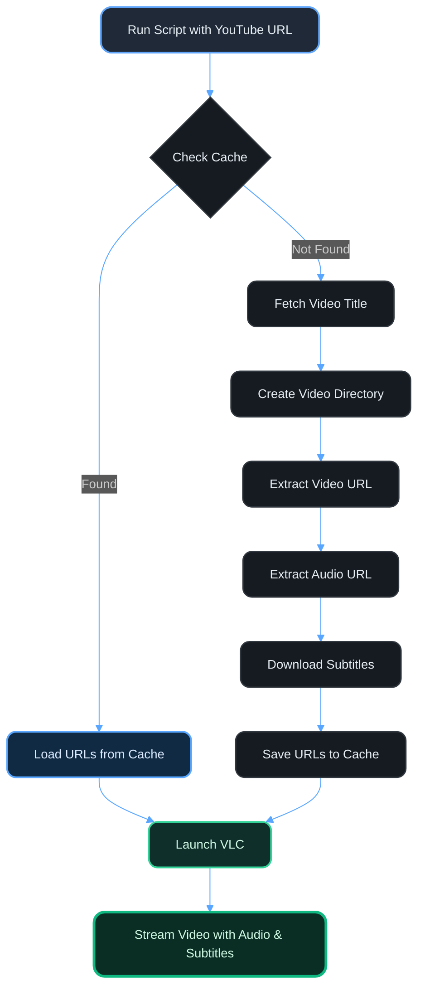

# 🎬 YouTube to VLC Stream Script

<div align="center">


**Stream YouTube videos directly in VLC with intelligent caching**

[Features](#-features) • [Installation](#-installation) • [Usage](#-usage) • [Configuration](#️-configuration) • [Troubleshooting](#-troubleshooting)

</div>

---

## ✨ Features

- 🚀 **Direct Streaming** - Stream YouTube videos in VLC without downloading
- 🎯 **Best Quality** - Automatically selects highest available video quality
- 💾 **Smart Caching** - Saves video URLs and subtitles for instant replay
- 📝 **Auto Subtitles** - Downloads and loads subtitles automatically
- ⚡ **Fast Loading** - Cached videos load instantly without re-fetching
- 🎵 **Merged Audio** - Seamlessly combines video and audio streams
- 📊 **Chapter Support** - Includes embedded chapters when available

---

## 📋 Prerequisites

Before installing, ensure you have the following:

- ✅ **Windows OS** (PowerShell 5.1 or later)
- ✅ **VLC Media Player**
- ✅ **yt-dlp** (YouTube downloader)
- ✅ **Internet Connection**

---

## 🔧 Installation

### Step 1: Install VLC Media Player

1. Download VLC from the official website:
   ```
   https://www.videolan.org/vlc/
   ```

2. Run the installer and complete the installation

3. Note your VLC installation directory (default: `C:\Program Files (x86)\VideoLAN\VLC\`)

### Step 2: Install yt-dlp

#### Option A: Using WinGet (Recommended)

Open PowerShell as Administrator and run:

```powershell
winget install yt-dlp.yt-dlp
```

#### Option B: Manual Installation

1. Download `yt-dlp.exe` from:
   ```
   https://github.com/yt-dlp/yt-dlp/releases/latest
   ```

2. Place it in a directory in your PATH or note its location

### Step 3: Download the Script

1. Create a new file named `stream-youtube.ps1` in your VLC directory

2. Copy the script content into this file

3. Verify the script location:
   ```
   C:\Program Files (x86)\VideoLAN\VLC\stream-youtube.ps1
   ```

### Step 4: Configure yt-dlp Path

1. Find your yt-dlp installation path:

   **For WinGet installation:**
   ```powershell
   C:\Users\user\AppData\Local\Microsoft\WinGet\Packages\yt-dlp.yt-dlp_Microsoft.Winget.Source_8wekyb3d8bbwe\yt-dlp.exe
   ```

   **To find your path, run:**
   ```powershell
   (Get-Command yt-dlp).Source
   ```

2. The script is already configured with the WinGet path. If yours is different, update line 8 in the script:
   ```powershell
   $ytdlpPath = "YOUR_YTDLP_PATH_HERE"
   ```

### Step 5: Configure Cache Directory

The script uses this default cache directory:
```
C:\Users\user\AppData\Local\Temp\New folder
```

To change it, update line 11 in the script:
```powershell
$baseDir = "YOUR_PREFERRED_CACHE_PATH"
```

### Step 6: Enable Script Execution

Open PowerShell as Administrator and run:

```powershell
Set-ExecutionPolicy -ExecutionPolicy RemoteSigned -Scope CurrentUser
```

---

## 🚀 Usage

### Basic Usage

1. Open PowerShell

2. Navigate to your VLC directory:
   ```powershell
   cd "C:\Program Files (x86)\VideoLAN\VLC"
   ```

3. Run the script with a YouTube URL:
   ```powershell
   .\stream-youtube.ps1 "https://www.youtube.com/watch?v=VIDEO_ID"
   ```

### Examples

**Stream a video:**
```powershell
.\stream-youtube.ps1 "https://www.youtube.com/watch?v=dQw4w9WgXcQ"
```

**Stream with automatic caching:**
```powershell
# First run - fetches and caches
.\stream-youtube.ps1 "https://www.youtube.com/watch?v=dQw4w9WgXcQ"

# Second run - loads from cache instantly
.\stream-youtube.ps1 "https://www.youtube.com/watch?v=dQw4w9WgXcQ"
```

---

## ⚙️ Configuration

### Script Variables

| Variable | Default | Description |
|----------|---------|-------------|
| `$ytdlpPath` | WinGet installation path | Path to yt-dlp.exe |
| `$baseDir` | `C:\Users\user\AppData\Local\Temp\New folder` | Cache directory |
| `$logFile` | `video_cache.log` | Cache log file name |

### VLC Arguments

The script uses these VLC arguments:
- `--input-slave` - Merges audio with video
- `--sub-autodetect-file` - Auto-detects subtitle files
- `--sub-file` - Specifies subtitle file path
- `--sub-track=0` - Enables first subtitle track

---

## 📁 Cache Structure

The script creates the following structure:

```
C:\Users\user\AppData\Local\Temp\New folder\
├── video_cache.log                          # Cache index
├── Video Title 1\
│   ├── urls.txt                             # Saved video/audio URLs
│   └── subtitle.en.srt                      # Downloaded subtitles
├── Video Title 2\
│   ├── urls.txt
│   └── subtitle.en.srt
└── ...
```

### Cache Log Format

```json
[
  {
    "YoutubeUrl": "https://www.youtube.com/watch?v=VIDEO_ID",
    "VideoDir": "C:\\Users\\user\\AppData\\Local\\Temp\\New folder\\Video Title",
    "CachedOn": "12/06/2025 10:30:45 AM"
  }
]
```

---

## 🎯 How It Works



---

## 🐛 Troubleshooting

### Issue: "yt-dlp is not found"

**Solution:**
- Verify yt-dlp is installed: `yt-dlp --version`
- Update the `$ytdlpPath` variable with correct path
- Reinstall yt-dlp if necessary

### Issue: "vlc.exe not found in current directory"

**Solution:**
- Navigate to VLC directory: `cd "C:\Program Files (x86)\VideoLAN\VLC"`
- Or update script to use full VLC path

### Issue: "Cannot validate argument on parameter 'ArgumentList'"

**Solution:**
- This happens when cache URLs are invalid
- Delete the cache directory and try again
- Check if the YouTube video is available in your region

### Issue: Script execution is disabled

**Solution:**
```powershell
Set-ExecutionPolicy -ExecutionPolicy RemoteSigned -Scope CurrentUser
```

### Issue: Subtitles not loading automatically

**Solution:**
- Check if subtitles were downloaded in the video directory
- Manually load subtitles in VLC: `Subtitle > Add Subtitle File`
- Ensure video has available subtitles on YouTube

### Issue: Cache not working

**Solution:**
- Check if `video_cache.log` exists in cache directory
- Verify cache directory has write permissions
- Delete `video_cache.log` to rebuild cache

---

## 📊 Performance

| Operation | First Run | Cached Run |
|-----------|-----------|------------|
| Video Title Fetch | ~2 seconds | ⚡ Instant |
| URL Extraction | ~3-5 seconds | ⚡ Instant |
| Subtitle Download | ~2-4 seconds | ⚡ Instant |
| Total Time | ~7-11 seconds | **~1 second** |

---

## 🔒 Privacy & Security

- ✅ No data is sent to external servers (except YouTube)
- ✅ All cache is stored locally on your machine
- ✅ URLs expire after ~6 hours (YouTube limitation)
- ✅ No personal information is logged

---

## 📝 License

This script is provided as-is for personal use. Feel free to modify and distribute.

---

## 🤝 Contributing

Contributions are welcome! Feel free to:
- 🐛 Report bugs
- 💡 Suggest features
- 🔧 Submit pull requests

---

## ⭐ Credits

- **yt-dlp** - YouTube download tool
- **VLC Media Player** - Video playback
- **PowerShell** - Automation scripting

---

<div align="center">

### 💖 Show Your Support

If this script helps you, give it a ⭐!

**Made with ❤️ for the community**

</div>
